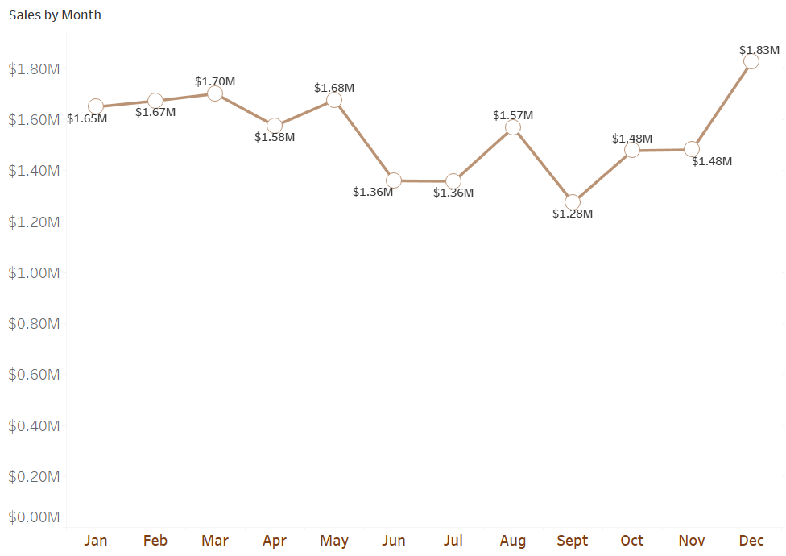
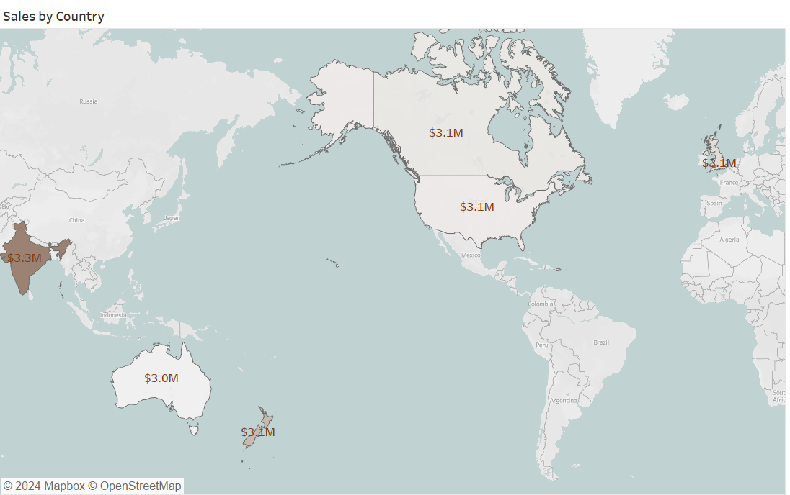
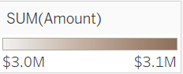
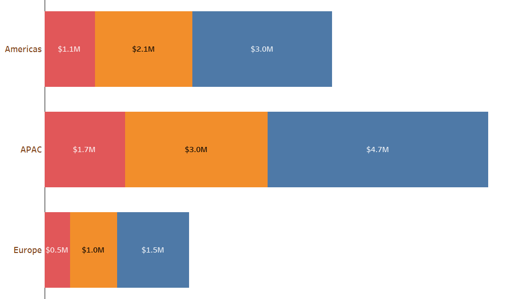
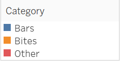
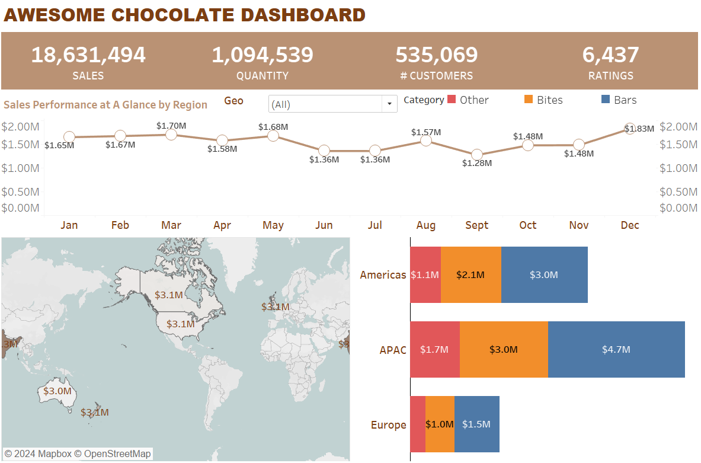

# Chocolate-Sales-Analysis - Tableau

---
## Introduction:
Awesome Chocolate is a premier chocolate manufacturer known for its exquisite range of chocolates crafted with the finest ingredients and meticulous attention to detail. 
Established in Mumbai, India, Awesome Chocolate has garnered international acclaim for its delectable offerings.
Therefore, this project work seek to analyze the sales performamnce of a multinational chocolate producing firm who distribute its product across four 4 countries: USA, Canada, The UK, and Australia with headquarter situated in Mubai India.

## About the Dataset:
The Data set we have chosen is a Sales report that lists the accomplishments of different salespeople in relation to various teams, geographical areas, and product categories. Names, gender, team, location,product specifics, sales numbers, customer interactions, and ratings are just a few of the details included in the report. The data covers a range of products, such as chocolate bars, bits, and other confections, and it is collected over a period in the year 2021. Download the dataset **_[here](SalesData.xlsx)_**.

A large dataset includes details about numerous people and their chocolate-related shopping patterns. Name, gender, salesperson image URL, company, country, area, type of chocolate product, size, date of purchase, sales amount, number of units sold, stock on hand, stock received, and stock ordered are just a few of the details that are included in each entry. This dataset has a record of 3300 entries with 16 variables and are all formatted in Excel tables.

---
Our Analysis is mostly focused on the main goal of obtaining insights into many facets of business performance through the analysis and visualization of sales-related data. 
The primary areas of emphasis are broken down as follows:

1. **Analysis of Sales Performance:** Any organization must understand its sales performance. Analyzing sales data according to several parameters, including product type, location, time frame, and salesperson, is part of this.

2. **KPIs, or key performance indicators, are:** Tracking important indicators like total sales, average sales, total customers, and salesperson effectiveness help to stay on top of business health and make progress toward the objectives.

3. **Analysis of Products and Categories:** Finding the best-performing goods, trends, and opportunities for development is made easier by breaking down sales data by product category. This analysis can inform product development, marketing strategies, and inventory management decisions.

4. **Geographic Evaluation:** Gaining knowledge about sales trends in various geographic areas can help to better understand consumer preferences, market penetration, and potential areas for growth or targeted marketing campaigns.

5. **Analysis of Time-Series Data:** It is possible to find areas of potential revenue optimization as well as seasonality and growth patterns by analyzing sales trends over time, such as sales by month or quarter. Using historical data, it also helps with sales forecasting for the future.

6. **Salesman Performance Assessment:** Assessing individual salesperson performance helps identify topperformers, coaching opportunities, and training needs. This analysis can optimize sales team management, incentive programs, and resource allocation.

7. **Visualization Techniques:** Making use of several visualization approaches, like time series visualizations, KPIs, maps, and stacked bar charts, improves data understanding and makes it easier for stakeholders to get actionable insights.

In general, the emphasis is on using data-driven insights to boost corporate performance, accelerate growth, and optimize sales methods. Strong capabilities for efficiently analyzing, visualizing, and communicating these insights to support decision-making processes are provided by Tableau.

**Application in use: TABLEAU**

## Key Skills Demonstrated:
* Using the Dynamic Parameter
* Using calculated field
* Filters
* Creating Relevant KPI using Metrics
* Labelling
* Line Chart (To Measure Sales Trend by Month, Quarter, or Year)
* Sales Mapping (Map feature)
* Stacked horizontal Bar Chart
* Using Shiny R Libary in R to create a Word Count
* Final Dashboard

---
## Findings and Reports

1. ### KPIs:

Fig 1: Key performance indicator

Using the given KPIs, we can determine the following:
**Sales Performance:** With $18,631,494 in revenue, the business has made a substantial amount of money. This suggests strong revenue generation and sales performance for the time period in question.
Product Demand: The company's products or services appear to be in high demand, as seen by the 1,094,539 units sold in total. This shows that the offerings are being well-received by the market and that customers are interested in them.

**Customer Base:** The business has built a sizable customer base with a total of 535,069 customers. This suggests that client retention and loyalty programs have a wide audience and potential.
Client satisfaction: Based on the 6,722 ratings received, it appears that the business regularly solicits client input. By examining these ratings, one can gain knowledge about client satisfaction levels as well as areas where the quality of products or services could be improved.All things considered, these KPIs show that the business is operating profitably when it comes to revenue, acquiring new clients, and possibly even customer satisfaction. Nonetheless, more examination and juxtaposition with records or sector standards might be imperative to comprehensively comprehend the organization's functioning and recognize prospects for expansion and enhancement.

2. ### Sales by Month:
**Parameters used: Geo, Amount, Month**
  
Fig 2: Sales by Month

From this data, we can observe fluctuations in sales throughout the year 2021. For example, there appears to be a peak in sales during March, May, and December, while sales may dip during June, July, and September. Analyzing these trends can help identify seasonal patterns, understand factors influencing sales performance, and make informed decisions regarding resource allocation, marketing strategies, and inventory management.

3. ### Sales by Month:
**Parameters used: Geo**
| Regional Sales  | Color bars        |
|-----------------|-------------------|
    |  |
Fig 3: Sales by Country

| Country     | Sales figure |
|-------------|--------------|
| India       |  $3,250,219  |
| New Zealand |  $3,139,591  |
| The UK      |  $3,079,538  | 
| Canada      |  $3,060,050  | 
| USA         |  $3,055,556  | 

Insights: Several conclusions can be made from the sales data by nation that is provided:
Regional Performance: The disparities in sales between the various nations reflect the differing degrees of market demand and regional economic circumstances.

Crucial Markets: The exceptionally high sales figures in countries like India and the USA indicate that these are crucial markets with substantial potential for generating income.

Geographic Spread: Information on the sales distribution among various nations can be gleaned about the client base and market penetration of a business.Market Opportunities: Lower sales numbers in some nations might point to unrealized market potential or growth prospects that could be achieved by focused marketing campaigns or expansion plans.

Market Dynamics: Differences in sales between nations may be due to variations in consumer tastes, purchasing power, the level of competition, or market saturation.

The analysis of sales data by nation can provide valuable insights for strategic decision-making processes, including pricing strategies, supply chain management, resource allocation, and foreign expansion initiatives. In general, firms can find opportunities, reduce risks, and streamline their operations to better serve a variety of global market segments by evaluating sales data by country.

4. ### Sales by product category In Based on Region:
**Horizontal Stacked Bar Char**

| Regional Sales         | Legend            |
|------------------------|-------------------|
|  |    |
Fig 4: Regional Sales by Category

Cat Sales Per Region: The total sales amount for each category within each region is provided in this column. It shows the total amount of money made from sales in the given region for every category.
Amount: The real sales amount expressed in monetary terms is shown in this column. It displays the amount of money made from the sale of each kind of product in each area.  

  
Sales table by Region

Insights: The information makes it possible to examine sales results across various product categories and geographical areas. As an illustration: For every category, the Asia-Pacific area has the greatest sales numbers, suggesting that this area is a sizable market for the company's goods.
There are differences in the sales performance of various product categories within each location. For example, bars and bites are more popularly sold in the Americas than other products.
The information offers perceptions into consumer demand and geographical preferences for product categories, which can guide decisions about product creation, inventory control, and marketing tactics.

In conclusion, a thorough understanding of the company's sales performance across various geographic areas and product offerings is made possible by the sales data by category and location that is presented.

## FINAL DASHBOARD:

